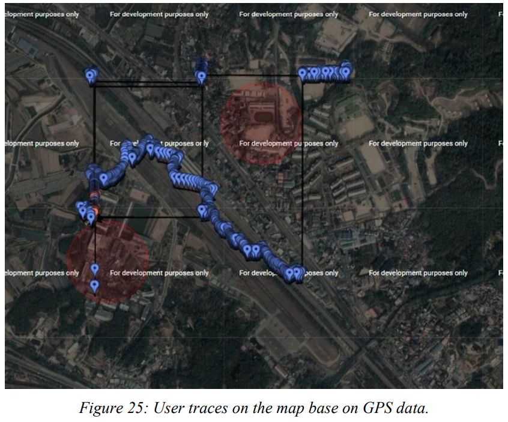

# COVID-19_Patient_Users_Tree_Network_NodeJS

## Alert based on Patient:

If there is patient in the data so the region around that user will become the red
alert region. The other normal user distance will be calculated based on Haversine formula. If there are
any users whose distance less than 1.5km the alert is generated.

## Alert based on Red Alert region:

If there is any restaurant and the AP find any patient come to here so
that region will become the red alert region. Now it is important to find the distance of each user who
come close to this region in 1.5km. Also, the alert is generated to those who visited that region.

## Working Demo screenshot

