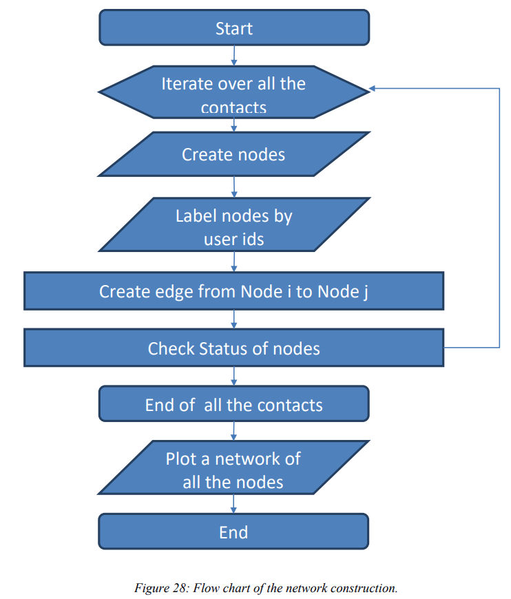
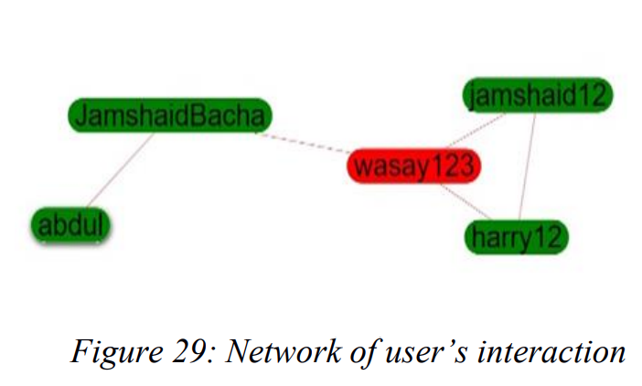

# Tree Construction

This field will explain about how the network link is create when there is interaction between users.
First, when the users install our mobile app, they will register through form and the user data will be
stored on the server securely. When the user is registering during this time, a unique key is generated for
the user which is called UUID. That unique id also stored with the user information. On the server there
is one table which we can say interaction table. The data come to this table will be used for network
creation. When all the users start moving around the city or the whole country the UUID’s will store in a
csv file in the user internal storage when they come in contact. That data will be stored on the server in
the interaction table

The flow of work can be show in below Figure

So, for the network plotting on the website side will use that interaction table. From the interaction table
first, it will find who relates to whom. The nodes will create for each user UUID first. The node by
default color normal user (Not a Patient). The node will label according to the user UUID username.
Will create a link between all the nodes who relate to each other.
Now, it is also important that the user is normal, suspected or patient. There are three cases so for each
different color is used. For normal user the node will be green, for suspected the node will be yellow and
for patient the node will be red. The status information will be fetching from the server table name status
table.

For those who are close enough to the user who are infected the status will be find based on TIE
strength. The tie strength will be calculated from the distance they both were interacted. The relationship
between tie strength and distance is inverse. The less distance the more will be the tie strength. The
second scenario for the tie strength is based on time for how long they were in contact. If the time is
27 more between the normal user and the patient the tie strength will be increase.

### How it works

When the user who was infected so if he/she recover so the status will change from the hospital according to that the network will update and the color of the node will be changed.

