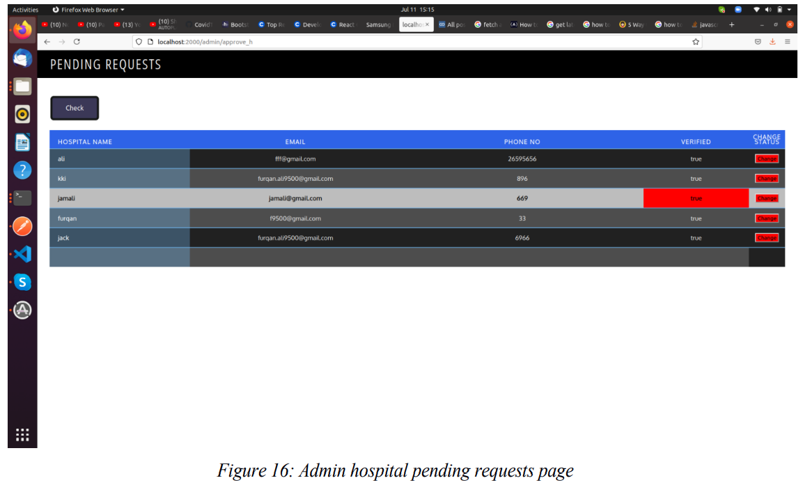
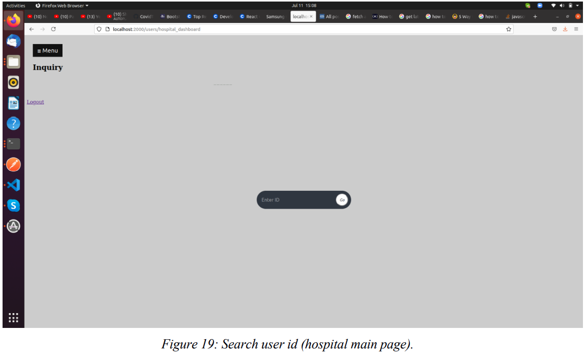
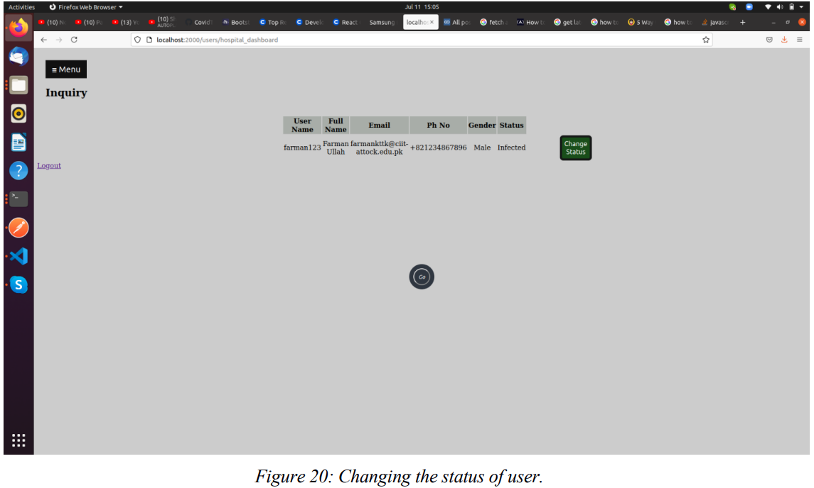

# Hospital side admin control

Our system needs the information about the covid positive persons. For the collection of covid positive
persons information, hospital dashboard is designed. In a hospital dashboard there are two kinds of user’s admin and hospital. Admin is the authority that approve each hospital with the help of some general information.

Hospital open webapp application and register hospital. After the registration hospital needs some approval from the administrator (admin). When hospital is approved then hospital login. Now hospital just enter each patient’s username and all information about that user is fetched from server automatically. Hospital needs to very their information and change their status.

### Working

