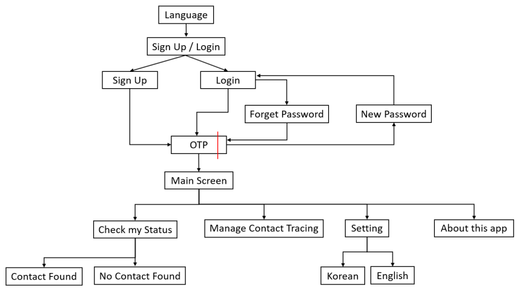
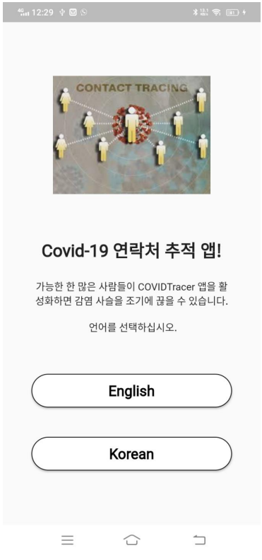
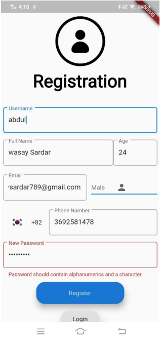
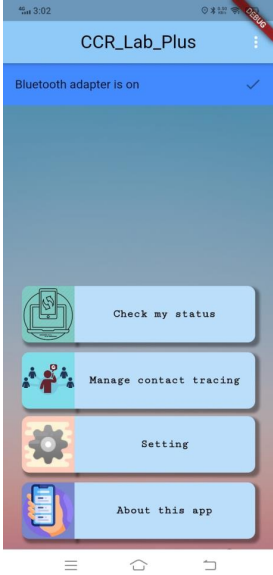
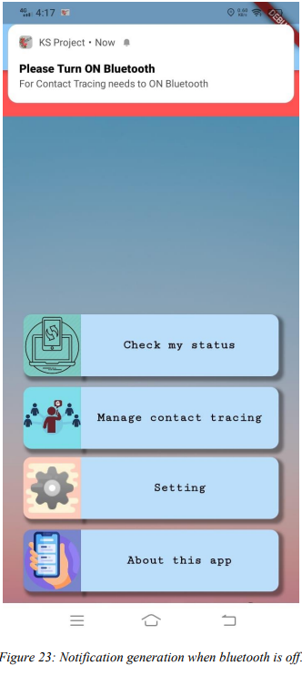
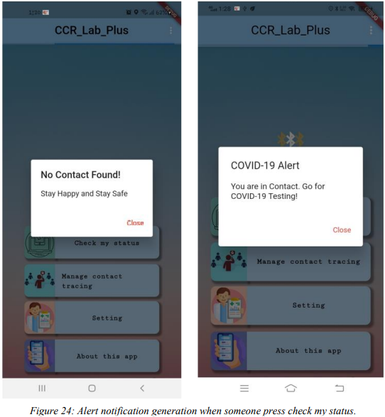

# Project Overview

KS mobile app is developed for the contact tracing of COVID-19 patient to avoid the spread of COVID-19. Health departments use contact tracing apps to find people who may have meet someone with COVID-19. KS app help to capture data (contacts of COVID-19 Patient) and watch the movement of people to make the process faster and more useful. KS Project has several features:

### Contact Tracing:

When someone is in your Bluetooth range, app automatically scan that app
user and Storing information first locally in a device and then store on the server. When someone is COVID positive, with the help of their contact information, app send alert message to all those who are in contact of that person.

### Alert:

Sending alert message to app users that are in contact of COVID-19 positive person.

### Geo-Fencing:

When someone is going to the area that is red alert area (area in which COVID-19 patients present), app send alert message that please careful you are going to enter red alert area.

### Contact Tracing Tree:

When someone is COVID positive or in contact of COVID positive patient, with the help of contact tree, the system identifies the overall contacts of that person.

### Access Point:

Deploying access points in the stores, public places, schools, universities and offices.
Available in English, and Korea Language.

The app is shown below

#### Main screen

#### Alert Generation

